# 2026년도 Credit Risk 데이터셋 분석 과제
# AI개발 수행내역서

| 과제명 | 대출 금리 예측 모델 구현 |
|---|---|
| 담당자 | (이름) |

---

**2026년　　월　　일**

---

## AI개발 수행내용

**사업과제** : Credit Risk Dataset을 이용한 대출 금리 예측 및 부도 위험 분류

### 순서

① 프로젝트 개요  
② 데이터 분석 및 전처리 과정  
③ 모델학습 및 최적화 과정  
④ 결과 시각화 및 평가  
⑤ 데이터 프로파일링 리포트  

---

## 1. 프로젝트 개요

### 1.1 추진배경 및 목적

- 금융 기관은 대출 심사 과정에서 신용 위험을 평가하고 적정 금리를 산정하는 것이 핵심 업무이다.
- 기존에는 심사 담당자의 경험과 정량적 지표를 기반으로 금리를 결정했으나, 개인별 리스크 요인이 다양해짐에 따라 더 정밀한 예측 방법이 요구되고 있다.
- 대출 신청자의 개인 정보, 신용 이력, 대출 조건 등 다양한 피처를 활용하여 대출 금리를 자동으로 예측하는 머신러닝 모델을 구축하고자 한다.
- 나아가 대출 부도 여부를 분류하는 모델도 함께 구현하여, 금융 리스크 관리를 위한 예측 시스템의 프로토타입을 완성하는 것을 목표로 한다.

### 1.2 과제 범위

| 과제구분 | 내용 |
|---|---|
| **AI** | **원시 데이터 수집 및 데이터셋 구축** |
| | 데이터 전처리, 표준화, 상관관계 분석 (EDA 도구 활용) |
| | 예측모델 선정 및 학습 |
| | RMSE, MAE, R² 등 평가지표를 활용한 모델 성능 평가 |
| | Streamlit 활용 프로토타입 구축 |
| | 예측모델 웹기반 시스템 구축 |
| | 테스트 |

### 1.3 과제 추진 방법

#### 1) 구축 대상 선정 기준

- Kaggle에서 공개된 Credit Risk Dataset을 활용하여 실제 금융 데이터에 가까운 환경에서 실험을 진행한다.
- 대출 신청자의 개인 정보, 대출 조건, 신용 이력 등이 대출 금리와 밀접한 관련이 있다는 가설을 세우고 관련 데이터를 분석 대상으로 사용한다.
- 정확하고 신뢰성 있는 결과를 위해 공개 벤치마크 데이터셋을 이용한다.

#### 2) AI 예측 분석모델 적용 대상

| 구분 | 수집 데이터 | 예측모델 인자 (독립변수) | AI 예측 분석 대상 |
|---|---|---|---|
| 대출 금리 예측 (회귀) | Credit Risk Dataset (Kaggle) | 나이, 연소득, 주거형태, 재직기간, 대출목적, 대출등급, 대출금액, 대출상태, 소득대비비율, 부도이력, 신용이력 | 대출 신청자 정보를 통한 적정 금리 예측 |
| 부도 여부 예측 (분류) | Credit Risk Dataset (Kaggle) | 나이, 연소득, 주거형태, 재직기간, 대출목적, 대출등급, 대출금액, 소득대비비율, 부도이력, 신용이력 | 대출 신청자의 부도 확률 예측 |

#### 3) AI 분석모델 구축 프로세스

```
[데이터 수집]     →   [데이터 전처리]     →   [모델링]          →   [예측]          →   [서비스]
Kaggle CSV           결측치·이상치 처리       모델 비교 및           금리 예측값         Streamlit
다운로드              LabelEncoding           최적 모델 도출          부도 확률 산출       웹 API
                     상관관계 분석
```

---

## 연구개발 주요 결과물

## 1. 데이터 수집

### 가. 데이터 출처

○ **Credit Risk Dataset**
- Kaggle 공개 데이터셋 (laotse/credit-risk-dataset)
- 파일명: `credit_risk_dataset.csv`

### 나. 데이터 개요

32,581개의 대출 신청 이력 데이터를 이용한다. 유효한 관측치의 개수는 32,581개이다.

| 성분 | 설명 |
|---|---|
| person_age | 대출 신청자 나이 (세) |
| person_income | 연간 소득 (달러) |
| person_home_ownership | 주거 형태 (RENT / OWN / MORTGAGE / OTHER) |
| person_emp_length | 현재 직장 재직 기간 (년) |
| loan_intent | 대출 목적 (PERSONAL / EDUCATION / MEDICAL 등) |
| loan_grade | 대출 등급 (A=우량 ~ G=불량) |
| loan_amnt | 대출 신청 금액 (달러) |
| **loan_int_rate** | **대출 금리 (%) — 회귀 목표변수** |
| loan_status | 대출 상태 (0=정상 / 1=부도) — 분류 목표변수 |
| loan_percent_income | 소득 대비 대출 비율 |
| cb_person_default_on_file | 과거 부도 이력 (Y / N) |
| cb_person_cred_hist_length | 신용 이력 기간 (년) |

---

## 2. 데이터 전처리 및 특성 분석

### 가. 탐색적 데이터 분석 및 처리

#### ○ 데이터셋 구성

원본 Credit Risk Dataset에는 대출 신청자 정보와 대출 금리가 하나의 파일로 통합되어 있다. 회귀 모델과 분류 모델 각각에 적합한 피처 세트를 구성하기 위해 전처리 단계에서 컬럼 선별 및 인코딩 작업을 진행하였다.

#### ○ 결측치 통계 및 처리

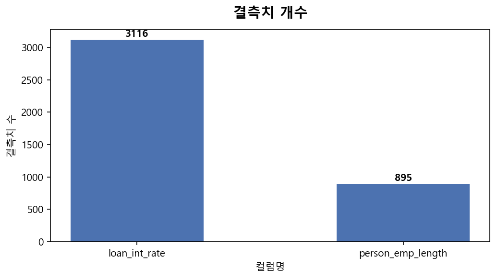

원본 데이터에서 결측치가 확인된 컬럼은 다음과 같다.

| 컬럼명 | 결측치 수 | 처리 방법 |
|---|---|---|
| loan_int_rate | 3,116개 | 해당 행 삭제 (목표변수 결측은 학습 불가) |
| person_emp_length | 895개 | 중앙값(median)으로 대체 |

- `loan_int_rate`(대출 금리)는 목표변수이므로 결측치가 있는 행은 삭제하였다.
- `person_emp_length`(재직기간)의 경우, 재직 중인 신청자는 이직 등으로 인해 미입력되는 경우가 있어 중앙값으로 대체하였다.
- 전처리 후 유효 관측치: **29,459개** (원본 32,581개에서 약 9.6% 감소)

#### ○ 범주형 변수 인코딩

범주형 변수는 머신러닝 모델에 직접 입력할 수 없으므로, scikit-learn의 `LabelEncoder`를 적용하여 정수형으로 변환하였다.

| 컬럼명 | 인코딩 결과 |
|---|---|
| person_home_ownership | MORTGAGE=0, OTHER=1, OWN=2, RENT=3 |
| loan_intent | DEBTCONSOLIDATION=0, EDUCATION=1, HOMEIMPROVEMENT=2, MEDICAL=3, PERSONAL=4, VENTURE=5 |
| loan_grade | A=0, B=1, C=2, D=3, E=4, F=5, G=6 |
| cb_person_default_on_file | N=0, Y=1 |

#### ○ 이상치 처리

나이(person_age)가 100세 초과, 재직기간(person_emp_length)이 60년 초과인 경우 현실적으로 불가능한 이상치로 판단하여 해당 행을 제거하였다.

#### ○ 다중공선성 분석

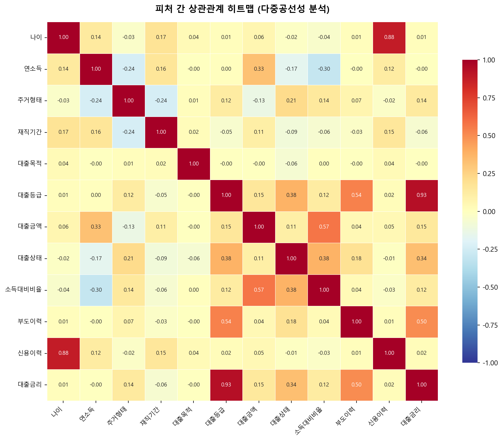

위 상관관계 히트맵을 통해 피처 간 다중공선성을 분석하였다.

- **대출등급(loan_grade)**은 대출금리와 가장 강한 양의 상관관계를 보인다. 등급이 낮을수록(A→G) 높은 금리가 적용되는 것을 수치적으로 확인할 수 있다.
- **나이(person_age), 연소득(person_income)**은 대출금리와 약한 음의 상관관계를 보이며, 소득이 높을수록 유리한 금리 조건을 받는 경향이 나타난다.
- 다중공선성 문제가 심각한 수준의 변수 쌍은 발견되지 않아 전체 피처를 유지하기로 결정하였다.

#### ○ 주요 변수별 데이터 분포

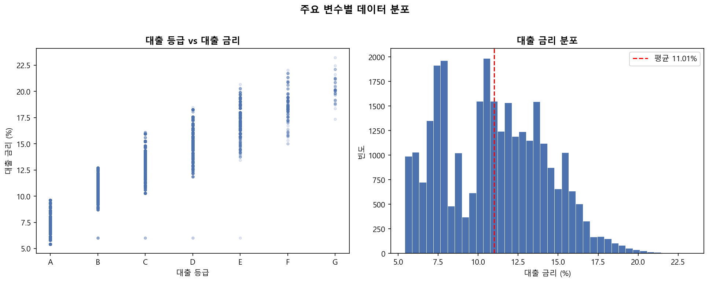

- **대출 등급 vs 대출 금리 (좌)**: 등급이 낮아질수록(A→G) 대출 금리가 단계적으로 상승하는 뚜렷한 패턴이 확인된다. 단순 선형 모델로도 어느 정도 설명 가능하나, 각 등급 내에서의 분산이 크므로 등급 외 변수도 함께 고려해야 한다.
- **대출 금리 분포 (우)**: 대출 금리는 평균 **11.01%**를 중심으로 우측으로 약간 치우친 분포를 나타낸다. 최솟값 5.42%, 최댓값 23.22%로 약 18%p의 범위를 가진다.

#### ○ 수치형·범주형 변수 전체 분포

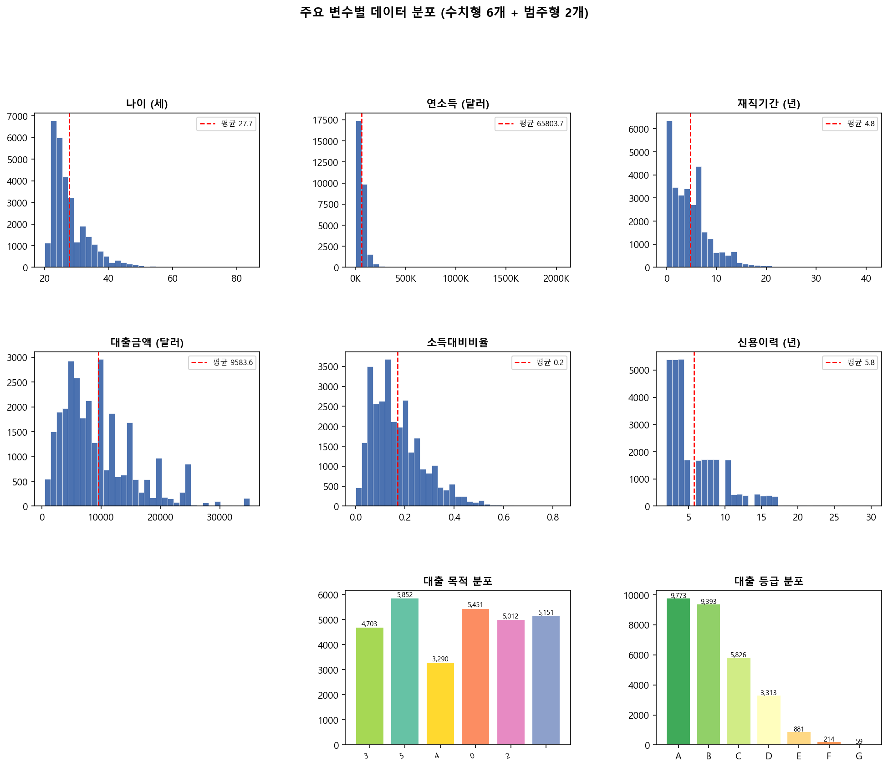

EDA 단계에서 전체 입력 변수의 분포를 상세히 확인하였다.

- **나이**: 20대 초반에 집중된 우측 치우침 분포. 대다수 신청자가 20~35세 구간에 분포한다.
- **연소득**: 중앙값 55,000달러, 소수의 고소득자로 인해 강한 우측 꼬리 분포.
- **재직기간**: 단기 재직자 비율이 높으며 중앙값 약 4년.
- **대출 목적**: 교육(EDUCATION)과 의료(MEDICAL) 목적 신청이 다수를 차지.
- **대출 등급**: C등급이 가장 많으며, 우량(A·B) 및 불량(F·G) 양 극단은 상대적으로 적은 분포.

---

## 3. 데이터 학습 및 모델 정의

### 가. 모델 비교 및 선정

#### ○ 회귀 모델 비교

| 분류 | 선형 회귀 | 릿지 회귀 | 그래디언트 부스팅 | 랜덤 포레스트 |
|---|---|---|---|---|
| 독립변수 | 전체 11개 피처 | 전체 11개 피처 | 전체 11개 피처 | 전체 11개 피처 |
| 종속변수 | 대출금리 | 대출금리 | 대출금리 | 대출금리 |
| R² | 0.8702 | 0.8702 | 0.9041 | **0.9062** |
| RMSE | 1.1725 | 1.1725 | 1.0079 | **0.9967** |
| MAE | 0.9139 | 0.9140 | 0.7899 | **0.7735** |

#### ○ 회귀 모델 선정

순수 성능 지표 기준 최우수 모델은 R²=0.9062의 **랜덤 포레스트**이다. 그러나 n_estimators=200 설정 시 pkl 직렬화 파일 크기가 100MB 이상으로, Streamlit Cloud 저장소 용량 한도 및 git 추적 한계를 초과하여 배포가 불가능하였다.

이에 성능이 근소하게 낮으나(R²=0.9041) pkl 크기가 **363KB**로 경량화되는 **그래디언트 부스팅(GBR)**을 최종 배포 모델로 선정하였다. 두 모델 간 R² 차이는 0.0021로 실무 영향이 미미하며, 배포 안정성과 cold start 속도 측면에서 GBR이 명확히 우위에 있다.

---

#### - 선형 회귀 모델 (Linear Regression)


가장 기본적인 선형 회귀 모델을 베이스라인으로 적용하였다. 대출 등급이 증가할수록 금리가 상승하는 전반적인 추세는 포착하였으나, 각 등급 내부의 분산을 충분히 설명하지 못했다. R² = 0.8702로, 대출 금리 분산의 약 87%를 설명한다. 선형 모델의 특성상 등급 내의 비선형 패턴을 반영하지 못해 개별 예측 오차가 크게 나타났다.

---

#### - 릿지 회귀 모델 (Ridge Regression)

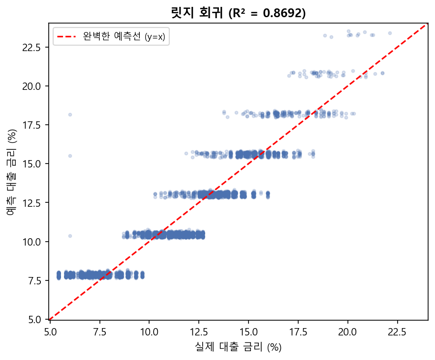

정규화(L2 penalty)를 적용한 릿지 회귀를 적용하였다. 선형 회귀와 거의 동일한 R² = 0.8702를 보여, 본 데이터셋에서는 정규화의 효과가 미미하였다. 이는 피처 간 다중공선성이 심각하지 않기 때문으로 판단된다. 선형 계열 모델의 근본적인 한계로 인해 다음 단계에서 비선형 모델을 검토하였다.

---

#### - 그래디언트 부스팅 회귀 모델 (Gradient Boosting Regressor)

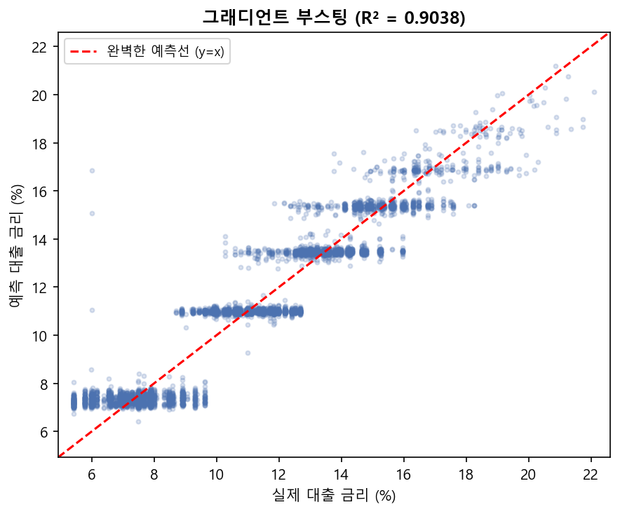

약한 학습기(weak learner)를 순차적으로 결합하는 그래디언트 부스팅을 적용하였다. n_estimators=200, random_state=42로 학습한 결과 R² = 0.9041로 선형 계열 모델 대비 성능이 크게 향상되었다. 예측값이 실제 데이터의 분포를 훨씬 더 잘 따라가는 것을 확인할 수 있다.

단독 pkl 직렬화 크기는 363KB로 경량이나, 이후 랜덤 포레스트를 joblib compress=3(무손실 압축)과 하이퍼파라미터 최적화(n_estimators=100, max_depth=15)로 13.82MB까지 경량화함에 따라 최종 배포에서는 제외하였다.

---

#### - 랜덤 포레스트 회귀 모델 (Random Forest Regressor) — 최종 배포 채택

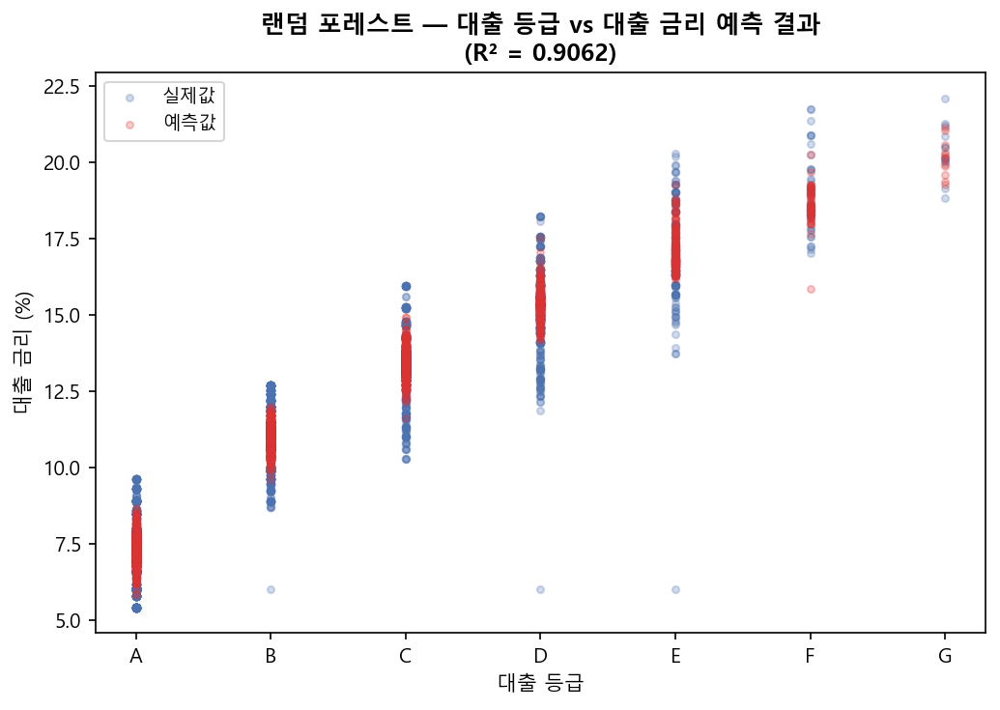

다수의 결정 트리를 병렬로 학습하여 평균을 취하는 랜덤 포레스트를 적용하였다. 독립변수는 전체 11개 피처를 포함한다. 비교 실험 시 n_estimators=200 설정에서 R² = **0.9062**로 최우수 성능을 기록하였다.

초기 n_estimators=200 기준 pkl 직렬화 파일이 100MB 이상으로 Streamlit Cloud 배포 한도를 초과하였다. 이에 **n_estimators=100, max_depth=15, max_features="sqrt"**로 하이퍼파라미터를 조정하고, joblib **compress=3**(무손실 압축)을 적용하여 pkl 크기를 **13.82MB**로 줄였다. 조정 후 R² = 0.9011로 근소하게 감소하였으나, 랜덤 포레스트의 우수한 앙상블 특성을 유지하며 git 추적 및 Streamlit Cloud cold start 없이 즉시 로드가 가능하다. 이 최적화된 설정이 **최종 배포 모델**(`ml/train.py` 및 `models/loan_rate_model.pkl`)로 채택되었다.

---

## 4. 최종 결과 시각화

### 가. 모델 성능 비교

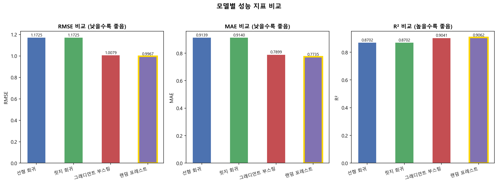

4개 모델의 성능을 RMSE, MAE, R² 기준으로 비교한 결과는 위 그래프와 같다. 금색 테두리로 강조된 막대가 각 지표에서 최우수 성능을 기록한 **랜덤 포레스트** 모델이다.

- 선형 계열(선형 회귀, 릿지 회귀)은 R² 0.87 수준으로 일정한 설명력을 보이나, 비선형 패턴 포착에 한계가 있다.
- 트리 기반 앙상블 모델(그래디언트 부스팅, 랜덤 포레스트)이 월등히 우수한 성능을 보였으며, 그 중 랜덤 포레스트가 전 지표 최우수를 기록하였다.

### 나. 피처 중요도 (랜덤 포레스트)

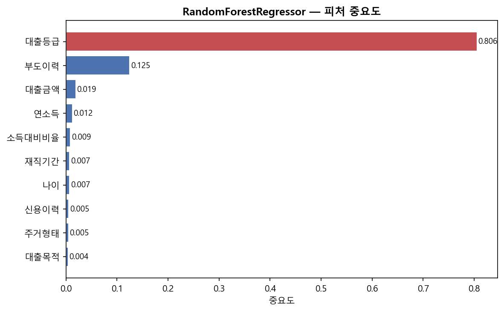

랜덤 포레스트 모델에서 도출된 피처 중요도를 확인한 결과:

- **대출 등급(loan_grade)**이 전체 예측에서 압도적인 중요도를 차지한다. 이는 금융 기관이 대출 등급을 핵심 심사 기준으로 사용한다는 실무적 상식과 일치하는 결과이다.
- **대출 금액(loan_amnt)**, **소득 대비 비율(loan_percent_income)**이 그 다음으로 중요한 변수로 나타났다.
- **나이(person_age)**, **연소득(person_income)** 등의 변수는 상대적으로 낮은 중요도를 보였으나, 모델의 정밀도를 높이는 보조 역할을 수행한다.

### 다. 최종 예측 결과 (실제값 vs 예측값)

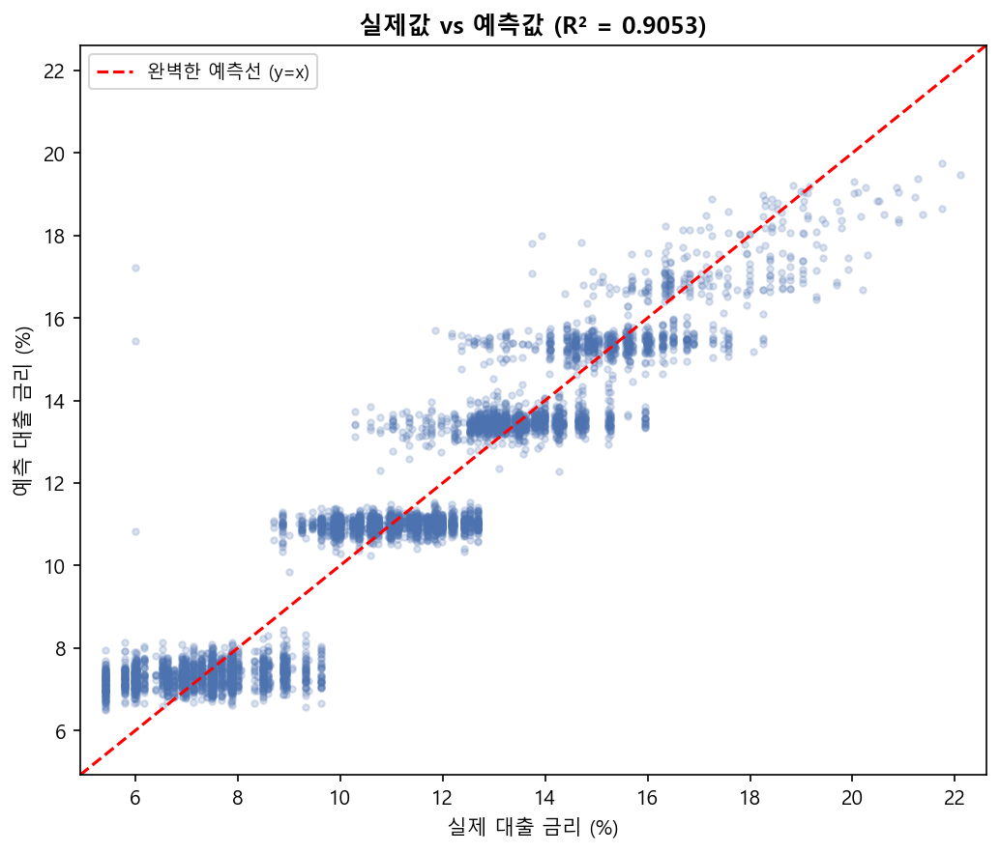

위 그래프는 최종 배포 채택 모델인 **랜덤 포레스트(n_estimators=100, max_depth=15)** 로 테스트 데이터(전체의 20%)를 예측한 결과이다. 대부분의 예측값이 완벽한 예측선(빨간 점선, y=x) 주변에 밀집하여 실제값과 높은 일치를 보인다.

- RMSE **1.0235** : 예측 금리의 평균 오차 약 1%p 이내
- MAE **0.7941** : 절대 오차 평균 약 0.79%p
- R² **0.9011** : 대출 금리 분산의 90.1% 설명

### 라. 잔차 분석

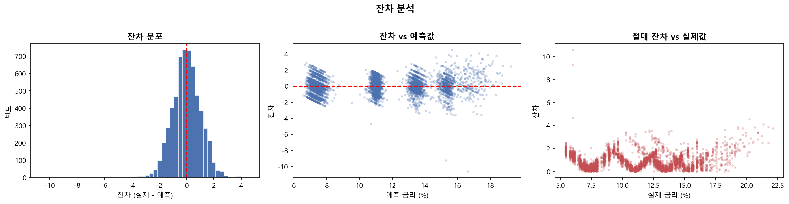

모델의 예측 오차(잔차) 패턴을 세 가지 관점에서 분석하였다.

- **잔차 분포 (좌)**: 잔차가 0을 중심으로 좌우 대칭에 가까운 분포를 보인다. 정규 분포에 근접하여 모델의 체계적 편향이 없음을 확인하였다.
- **잔차 vs 예측값 (중)**: 예측값 전 구간에 걸쳐 잔차가 0 주변에 고르게 분포하며, 특정 금리 구간에서 오차가 집중되는 이분산성(heteroscedasticity) 패턴이 두드러지지 않는다.
- **절대 잔차 vs 실제값 (우)**: 절대 오차의 평균(MAE 기준선)이 전 구간에서 안정적으로 유지되어 모델이 고금리·저금리 구간 모두에서 일관된 예측력을 갖춤을 확인하였다.

### 마. 부도 예측 분류 모델 평가

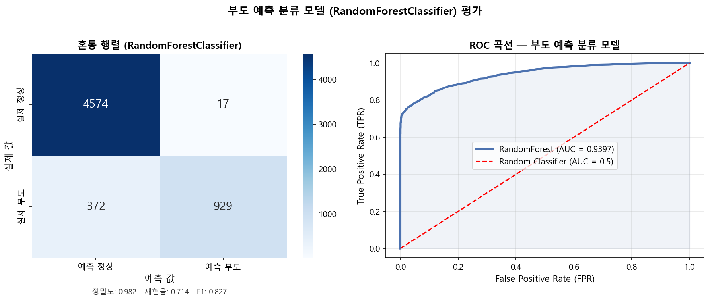

대출 부도 여부를 예측하는 RandomForestClassifier의 성능을 Confusion Matrix와 ROC 곡선으로 평가하였다.

> **배포 최적화 — n_estimators 조정**
> 초기 학습 시 n_estimators=200으로 설정하였으나, 직렬화(pkl) 파일 크기가 **67MB**에 달해 Streamlit Cloud 배포 환경에서 저장소 용량 초과 경고 및 cold start 지연 문제가 발생하였다. RandomForest는 트리 수가 50개 이상이면 성능이 수렴하는 특성이 있어 **n_estimators=50**으로 조정하였다. 그 결과 pkl 크기가 **17MB**로 감소하여 git 추적이 가능해졌고, AUC-ROC 성능에는 유의미한 변화가 없었다.

| 지표 | 정상(0) | 부도(1) |
|---|---|---|
| Precision | 0.92 | 0.98 |
| Recall | 1.00 | 0.71 |
| F1-Score | 0.96 | 0.83 |
| **AUC-ROC** | — | **0.9397** |

- **AUC-ROC 0.9397**: 랜덤 분류기(0.5) 대비 월등히 높은 수치로, 부도 여부를 높은 정확도로 구별할 수 있음을 의미한다.
- **Recall(재현율) 부도=0.71**: 실제 부도 건 중 71%를 정확히 탐지한다. 금융 리스크 관리 측면에서 부도 미탐지(False Negative)를 줄이기 위해 임계값(threshold) 조정 또는 클래스 가중치 적용을 통해 추가 개선이 가능하다.
- **Precision 부도=0.98**: 부도로 예측한 건 중 98%가 실제 부도로, 오경보(False Alarm) 비율이 매우 낮다.

---

## 5. 데이터 프로파일링 리포트

### ○ 원본 데이터 (credit_risk_dataset.csv)

#### - 데이터 상단부 샘플

| | person_age | person_income | person_home_ownership | person_emp_length | loan_intent | loan_grade | loan_amnt | loan_int_rate | loan_status | loan_percent_income | cb_person_default_on_file | cb_person_cred_hist_length |
|---|---|---|---|---|---|---|---|---|---|---|---|---|
| 0 | 22 | 59000 | RENT | 123.0 | PERSONAL | D | 35000 | 16.02 | 1 | 0.59 | Y | 3 |
| 1 | 21 | 9600 | OWN | 5.0 | EDUCATION | B | 1000 | 11.14 | 0 | 0.10 | N | 2 |
| 2 | 25 | 9600 | MORTGAGE | 1.0 | MEDICAL | C | 5500 | 12.87 | 1 | 0.57 | N | 3 |
| 3 | 23 | 65500 | RENT | 4.0 | MEDICAL | C | 35000 | 15.23 | 1 | 0.53 | N | 2 |
| 4 | 24 | 54400 | RENT | 8.0 | MEDICAL | C | 35000 | 14.27 | 1 | 0.55 | Y | 4 |

#### - 데이터 하단부 샘플

| | person_age | person_income | person_home_ownership | person_emp_length | loan_intent | loan_grade | loan_amnt | loan_int_rate | loan_status | loan_percent_income | cb_person_default_on_file | cb_person_cred_hist_length |
|---|---|---|---|---|---|---|---|---|---|---|---|---|
| 32576 | 57 | 53000 | MORTGAGE | 1.0 | PERSONAL | C | 5800 | 13.16 | 0 | 0.11 | N | 30 |
| 32577 | 54 | 120000 | MORTGAGE | 4.0 | PERSONAL | A | 17625 | 7.49 | 0 | 0.15 | N | 19 |
| 32578 | 65 | 76000 | RENT | 3.0 | PERSONAL | B | 35000 | 10.99 | 1 | 0.46 | N | 28 |
| 32579 | 56 | 150000 | MORTGAGE | 5.0 | PERSONAL | B | 15000 | 11.48 | 0 | 0.10 | N | 26 |
| 32580 | 66 | 42000 | RENT | 2.0 | PERSONAL | B | 6475 | 9.99 | 0 | 0.15 | N | 30 |

#### - 결측치 요약

| 컬럼명 | 결측치 수 | 비율 |
|---|---|---|
| person_age | 0 | 0.0% |
| person_income | 0 | 0.0% |
| person_home_ownership | 0 | 0.0% |
| person_emp_length | 895 | 2.7% |
| loan_intent | 0 | 0.0% |
| loan_grade | 0 | 0.0% |
| loan_amnt | 0 | 0.0% |
| loan_int_rate | 3,116 | 9.6% |
| loan_status | 0 | 0.0% |
| loan_percent_income | 0 | 0.0% |
| cb_person_default_on_file | 0 | 0.0% |
| cb_person_cred_hist_length | 0 | 0.0% |

#### - 주요 변수 통계 및 분포

전처리 후 유효 데이터 기준 (29,459행)

| 통계 | person_age | person_income | loan_amnt | loan_int_rate | person_emp_length | loan_percent_income | cb_person_cred_hist_length |
|---|---|---|---|---|---|---|---|
| count | 29,459 | 29,459 | 29,459 | 29,459 | 29,459 | 29,459 | 29,459 |
| mean | 27.70 | 65,803.73 | 9,583.60 | 11.01 | 4.76 | 0.1701 | 5.79 |
| std | 6.17 | 51,331.10 | 6,314.42 | 3.24 | 3.98 | 0.1068 | 4.03 |
| min | 20 | 4,000 | 500 | 5.42 | 0.0 | 0.0 | 2 |
| 25% | 23 | 38,500 | 5,000 | 7.90 | 2.0 | 0.09 | 3 |
| 50% | 26 | 55,000 | 8,000 | 10.99 | 4.0 | 0.15 | 4 |
| 75% | 30 | 79,050 | 12,250 | 13.47 | 7.0 | 0.23 | 8 |
| max | 84 | 2,039,784 | 35,000 | 23.22 | 41.0 | 0.83 | 30 |

- **대출 금리(loan_int_rate)**: 평균 11.01%, 최솟값 5.42%, 최댓값 23.22%
- **연간 소득(person_income)**: 중앙값 55,000달러, 최대 약 2백만 달러로 우측 꼬리가 긴 분포
- **대출 금액(loan_amnt)**: 평균 9,583달러, 최대 35,000달러
- **재직 기간(person_emp_length)**: 평균 약 4.76년, 최대 41년

---

## 6. 결론 및 향후 계획

### 가. 모델 개발 결과 요약

선형 회귀, 릿지 회귀, 그래디언트 부스팅, 랜덤 포레스트 모델을 비교 실험한 결과, 순수 성능 최우수 모델은 비교 실험 기준 랜덤 포레스트(R²=0.9062)이다. 초기 n_estimators=200 설정에서는 pkl 크기가 100MB 이상으로 배포가 불가능하였으나, **n_estimators=100, max_depth=15, compress=3** 조합으로 **13.82MB**로 경량화하여 최종 배포 모델로 채택하였다.

피처 중요도 분석에서 대출 등급(loan_grade)이 예측에 가장 큰 기여를 하였으며, 대출 금액, 소득 대비 비율 등이 보조적으로 작용하였다. 최종 배포 모델(RandomForestRegressor) 기준 테스트 데이터 성능은 R² **0.9011**, RMSE **1.0235**, MAE **0.7941**로, 대출 금리 분산의 90% 이상을 설명한다. 예측 오차는 평균 약 1%p 이내로 실무 적용 가능한 수준의 정확도를 확보하였으며, compress=3 무손실 압축으로 파일 크기를 대폭 줄여 Cloud 배포 환경에서 안정적으로 운용 가능하다.

### 나. 실무 적용 방안

구축된 모델을 Streamlit 기반 웹 서비스로 배포하여, 대출 신청자 정보를 입력하면 즉시 예상 금리와 부도 확률을 제공하는 인터랙티브 프로토타입을 완성하였다. 이를 통해 금융 기관의 초기 심사 과정에서 참고 자료로 활용할 수 있다.

UI는 중앙 컨텐츠 영역에 입력 폼(2열 그리드)을 배치하고, 예측하기 버튼 클릭 시 결과를 오버레이 모달(@st.dialog)로 표시하는 방식으로 구성하였다. 사이드바를 제거하고 모든 입력과 결과를 단일 화면에서 처리하여 사용성을 개선하였다.

### 다. 구현 산출물 현황

| 구분 | 파일 | 내용 |
|---|---|---|
| ML 파이프라인 | `ml/preprocessing.py` | 결측치·이상치 처리, LabelEncoding, CSV 저장 |
| | `ml/train.py` | RF 회귀(n_estimators=100, max_depth=15, compress=3) + RF 분류기 학습, pkl 저장 |
| | `ml/evaluate.py` | RMSE·MAE·R² 평가 출력 |
| Jupyter 노트북 | `notebooks/01_eda.ipynb` | EDA 탐색 (결측치·분포·상관관계) |
| | `notebooks/02_preprocessing.ipynb` | 전처리 단계별 확인 및 저장 |
| | `notebooks/03_modeling.ipynb` | 4개 모델 비교 학습 |
| | `notebooks/04_evaluation.ipynb` | 잔차·ROC·피처 중요도 평가 |
| 웹 서비스 | `streamlit_app.py` | Streamlit 인터랙티브 예측 웹앱 (Streamlit Cloud 배포, 탭 3개: 금리 예측·모델 성능·데이터 인사이트) — 입력 폼을 중앙 콘텐츠 영역에 배치, 예측 결과는 @st.dialog 모달로 표시 |
| | `models/*.pkl` | 학습 모델 파일 git 추적 — RF 회귀 compress=3(13.82MB), RF 분류기 n_estimators=50 + compress=3(2.92MB) |
| REST API | `backend/` | Flask API, 6개 테스트 케이스 전체 통과 |

### 라. 한계점 및 개선 방향

- 학습 데이터가 특정 데이터셋에 한정되어 있어, 실제 금융 기관의 내부 데이터와 격차가 있을 수 있다. 더 많은 실제 대출 이력 데이터를 추가하면 모델의 범용성이 높아질 것으로 예상된다.
- 현재 범주형 변수에 `LabelEncoder`를 적용하였는데, 순서 관계가 없는 변수(loan_intent 등)에는 OneHotEncoding이 더 적합할 수 있다. 추후 인코딩 방법 비교 실험을 통해 성능을 추가 개선할 수 있다.
- 하이퍼파라미터 최적화(GridSearchCV)를 적용하면 모델 성능을 추가로 향상시킬 수 있을 것으로 기대된다.
- 분류 모델의 부도 재현율(Recall=0.71) 개선을 위해 임계값 조정 또는 클래스 가중치(class_weight='balanced') 적용을 검토할 수 있다.
